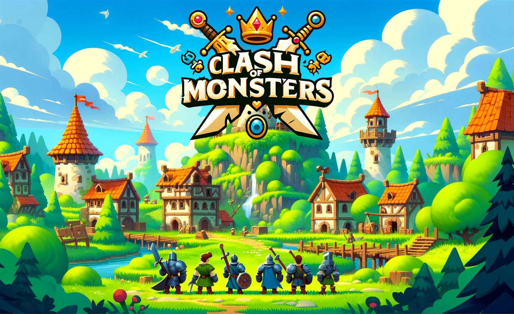
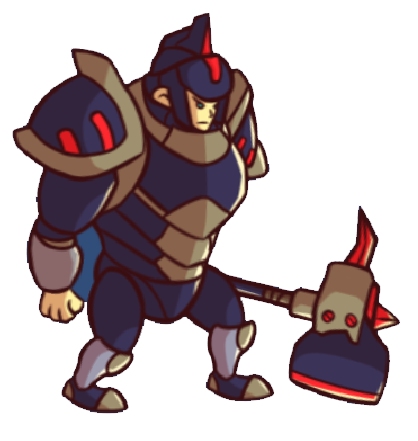
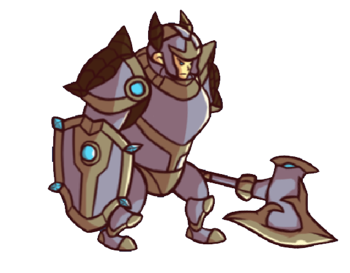
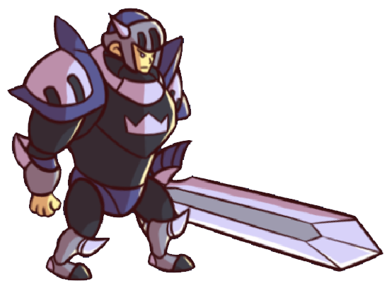

# Clash Of Monsters

>### Clash Of Monsters is a 2D strategy game in which each player choose his troops wiselly in order to defeat Warrok

**Submission  Content**

---
-  <strong><em>[Game Play Video](https://youtu.be/x_h7B4d9Dw4)</em></strong> 
-  <strong><em>[Itch.io Game](https://uzano101.itch.io/clash-of-monsters)</em></strong> 
-  <strong><em>[CodeReview Video](https://youtu.be/MqtiuijOg1U)</em></strong> 

**Game Mechanics**

---
Each player is granted by certain amount of money. In order to defeat Warrok the player must kill all the monsters on the map and then kill him.   
**How To Do It?**
1. Choosing a troop from the troops panel, each with his own advantages and disadvantages.
2. Left click (mouse) in the desirable place on the screen to spawn the troop. 

**NOTE:** Each troop has its own price so the player must think carefully when choosing troops.

**Boss Mechanics**

---
  
  
The Boss is patrolling left ans right untill someone attacks him, and then he enters attack mode. if no one attacks the boss for 5 seconds, he return to patrol.

**Boss Phases**

---
- patrolling Phase - in this phase the boss waits for the troops to kill all the enemies in the map and menwile patrols right and left.
- Attacking Phase - when a troop comes nearby the boss and attacks him, he attacks him back.

**Enemies Mechanics**

---
in order to attack Warrok, kill all the enemies in the map. the enemies are wait until a troop enters to the attack range and then run after him and attack him. they attack the closest one to them.

**Player Mechanics**

---
in order to attack Warrok, one must choose the troop he wants to spawn and then if he has enough money in his bank he needs to touch the screen wherever he wants the tropp to be spawned. The player can change the troop selector any time he wants.

- **Ram Smashers**: These troops has good attack damage, but they're slow and can get hit a lot while they move.

- **Iron Guardians**: These warriors hit hard and can take a lot of hits themselves, but they're very slow and can be outmaneuvered by fast enemies.

- **Swift Blades**: These fighters are super fast and hit fast too, but they don't have much armor, so they can't take many hits.

**Art**

---
Unity Assets Store. 
- Players at <strong><em>[This Page](https://assetstore.unity.com/packages/2d/characters/warriors-animated-2d-characters-178121)</em></strong> 
- Terrain at <strong><em>[This Page](https://assetstore.unity.com/packages/2d/environments/hex-medieval-fantasy-locations-59271)</em></strong> 

**AI**

---
- The AI system for the troops is to follow the closest target. In phase one, the targets are the fences while in the next phases the target is warrok.
- The AI system for Warrok is to attack the closest troop during phases one and two, and to run away to a safe point in phase three.

**UI**

---
The UI system includes the following info:
- The player's bank balance.
- Warrok's life.
- Troops selector.
- Timer for the time passed from beginning.
- Troops' life.

